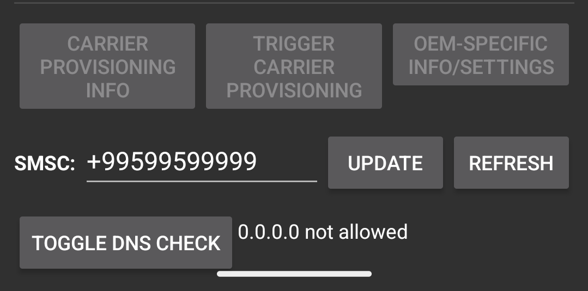
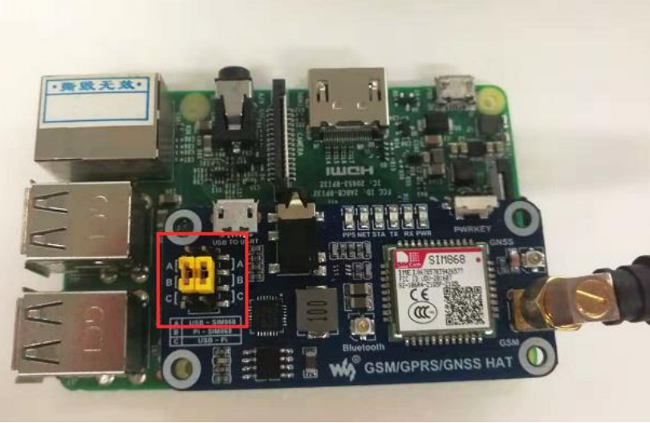
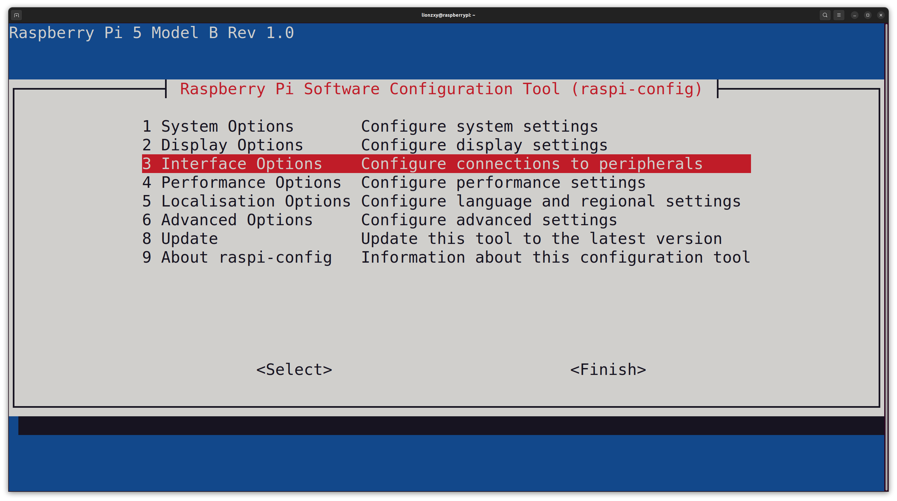
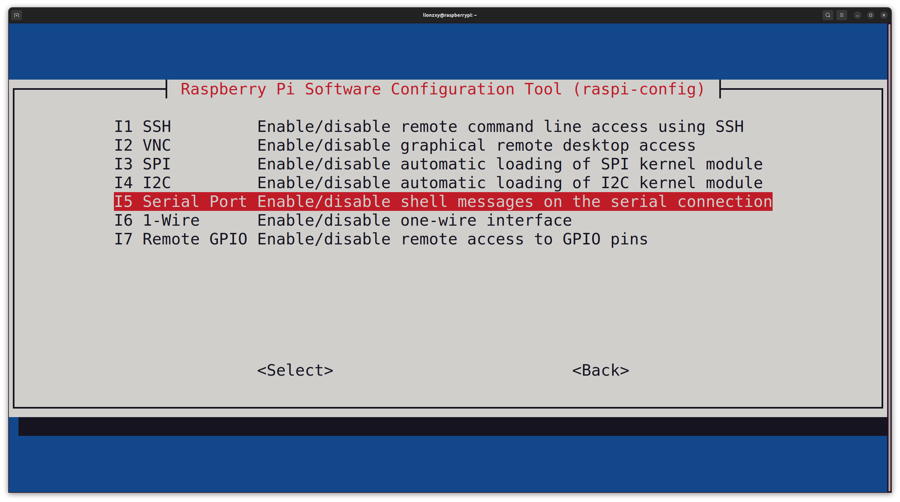
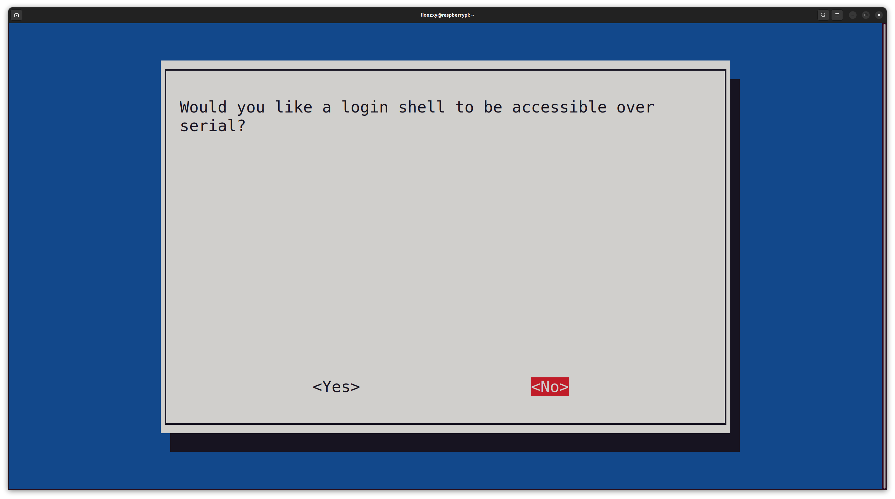
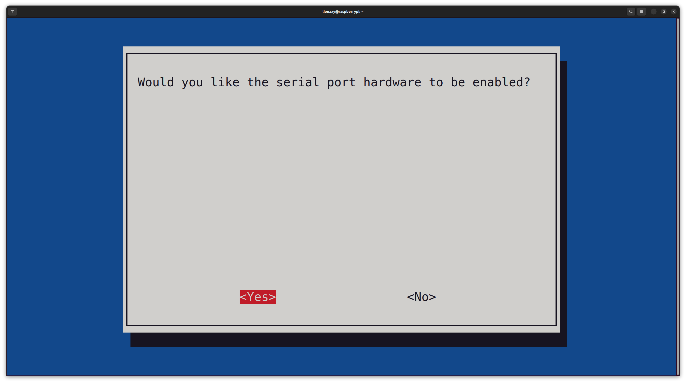
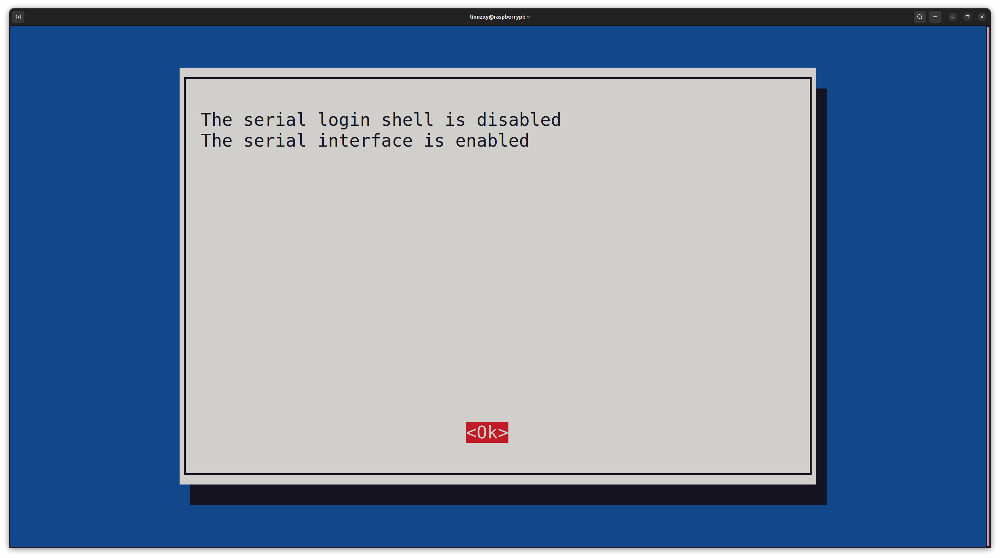

# SIM868 Raspberry Pi 5 SMS Forwarder

Dockerised Python script for Raspberry PI (including 5) to send sms from SIM868 to Telegram

## Installation

1) Firstly you need to find out the SMSC of your sim/region. To do this:
   1. Insert your SIM into your Android device
   2. Dial the `*#*#4636#*#*` (to get to the system menu).
   3. Select "Phone information".
   4. Scroll down to the "SMSC" item
   5. If the SMSC number is not there, press "Refresh"
   
   
2) Insert the SIM card into the module
3) Install SIM868 in Raspberry Pi GPIO 40-pin port
4) Set the jumper to B as below



5) Enable serial on Raspberry Pi: Type `sudo raspi-config` in console -> Interfaces Options -> Serial Port -> No -> Yes

|  |  |  |
|----------------------------|----------------------------|----------------------------|
|  |  |                            |

6) Install docker (Instruction [here](https://docs.docker.com/engine/install/debian/#install-using-the-repository))
7) Clone this project in any folder and go to it
```bash
git clone https://github.com/LionZXY/SMS2Telegram
cd SMS2Telegram
```
8) Create `.env` file with this fields:

| Field           | Description                                                                                                                                  | Example                                   |
|-----------------|----------------------------------------------------------------------------------------------------------------------------------------------|-------------------------------------------|
| TG_TOKEN        | Telegram token for the bot, created in BotFather (read more [here](https://core.telegram.org/bots/features#botfather))                       | 123456:ABC-DEF1234ghIkl-zyx57W2v1u123ew11 |
| TG_CHAT_ID      | ID of the chat room where messages will be sent. I get this parameter by open `https://api.telegram.org/bot%TG_TOKEN%/getUpdates` in browser | 1235433892                                |
| SERIAL_PORT     | The port through which the Raspberry PI and SIM868 communicate. For Raspberry Pi 4 it can be `/dev/ttyS0`. You can check this with minicom   | /dev/ttyAMA0                              |
| SMSC            | SMSC address, this may be unique for each operator/country                                                                                   | +99599599999                              |
| REPORT_TIMEZONE | Timezone to which message arrival time will be converted                                                                                     | "Europe/London"                           |

Example `.env` file is:
```
TG_TOKEN=123456:ABC-DEF1234ghIkl-zyx57W2v1u123ew11
TG_CHAT_ID=1235433892
SERIAL_PORT=/dev/ttyAMA0
SMSC=+99599599999
REPORT_TIMEZONE="Europe/London"
```
9) Execute `docker compose up -d`. Warning: Important to build Docker image specifically on Raspberry Pi


## Spreadsheet

- Enable PDU Mode: `AT+CMGF=0`
- Enable Text Mod: `AT+CMGF=1`
- Set SMSC to +99599599999: `AT+CSCA="+99599599999"`
- Switch to PDU mode: `AT+CMGF=0`
- Receive all unread messages (PDU Mode only): `AT+CMGL=0`
- Receive all messages (PDU Mode only): `AT+CMGL=4`
- Receive all messages (TEXT mode only: `AT+CMGL="ALL"`
- Read message with index 1: `AT+CMGR=1`
- Delete message with index 1: `AT+CMGD=1`

## Resources

- [GSM/GPRS/GNSS HAT User Manual/PDF](docs/GSM_GPRS_GNSS_HAT_User_Manual_EN.pdf)